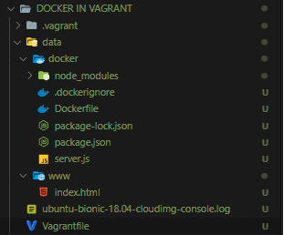

# Docker-and-Vagrant

Before dealing with docker and vagrant, if you don't know what these techonologies exactly are, have a look at this article.

WHAT IS VAGRANT? WHAT IS DOCKER?

 - [https://medium.com/@Mahmoud_Zalt/vagrant-vs-docker-679c9ce4231b](https://medium.com/@Mahmoud_Zalt/vagrant-vs-docker-679c9ce4231b)

## Why vagrant and docker?

Say, you have a application running in your windows/mac OS which you need to deploy in your server which is ubuntu. At times the application may not run proprely as it is intended when you deplouy in the server. So, before deaploying on to the server, you will have to test the application either :

- In virtual environment ( i.e., installing a local ubuntu server ) (if you might think to go with installing the OS manually in virtualization software, yes you can do that but it will be time consuming if you have to repeat the same for different projects which have to deployed in different server) or
- By packing the application inside a docker container and then run the same in the sever.

---

<br >

Now, for some reason you need to either run DOCKER CONTAINER INSIDE VAGRANT BOX. Well, either of this is possible and let's see how we can do that.

REQUIREMENTS:

Install  vagrant, virtualbox, docker.

## HOW TO RUN DOCKER CONTAINER INSIDE VAGRANT BOX?

- What we gonna achieve here is create a virtual machine (which run on virtual box) via VagrantFile and install docker inside the box.
- Finally we are gonna host a simple website in virtual machine and inside docker as well.

In other words, our OS on vagrant runs in virtual box and the docker runs inside vagrant box.

- First, create a index.html file which we will then host in the vagrant box itself.

__*index.html*__

```jsx
<!DOCTYPE html>
<html lang="en">
<head>
  <meta charset="UTF-8">
  <meta http-equiv="X-UA-Compatible" content="IE=edge">
  <meta name="viewport" content="width=device-width, initial-scale=1.0">
  <title>VAGRANT</title>
</head>
<body>
  <h1>HELLO FROM VAGRANT BOX</h1>
</body>
</html>
```

- Second, create a simple node application which will be hosted in doker container and build a docker image with the same.

__*sever.js*__

```jsx
const express = require('express')

const app = express()

app.get('/', (req, res)=>{
  res.send("HELLO FROM DOCKER CONTAINERS")
})

app.listen(3000)
```

__*Dockerfile*__

```jsx
FROM node:14

WORKDIR /usr/src/app

COPY package*.json ./

RUN npm install

COPY . .

EXPOSE 3000

CMD [ "node", "server.js" ]
```

Now we need a VagrantFile to create a ubuntu box, which will hold all the above contents.

__*VagrantFile*__

```jsx
Vagrant.configure("2") do |config|
  config.vm.box = "ubuntu/bionic64"

   config.vm.network "private_network", ip: "192.168.33.10"

   config.vm.synced_folder "./data", "/data"
   config.vm.provision "docker"
   config.vm.provider "virtualbox" do |vb|
   end

  config.vm.provision "shell", inline: <<-SHELL
    apt-get update
    apt-get install -y apache2
    service apache2 restart
    sudo cp /data/www/index.html /var/www/html/
    sudo apt install docker.io y

    cd /data/docker/
    sudo docker build . -t docker_application
    sudo docker run -p 8080:8080 docker_application
    sudo systemctl enable docker
    
  SHELL
  
end
```

And the file structure would look something like this.

<br>




---

<br >

ABOVE WE USED A BASE OS (ubuntu) ON VAGRANT, BUT VAGRANT COMES WITH SUPPORT FOR USING DOCKER AS A PROVIDER. Which means the development environment is backed by docker instead of the virtual machine (virtualbox in the above case).

---

Finally you can reach the web page of docker at `192.168.33.10` and webpage of docker in `192.168.33.10:8080`

---

So, in next article we can see how to use docker as a provider, and hey also how to use vagrant inside a docker.